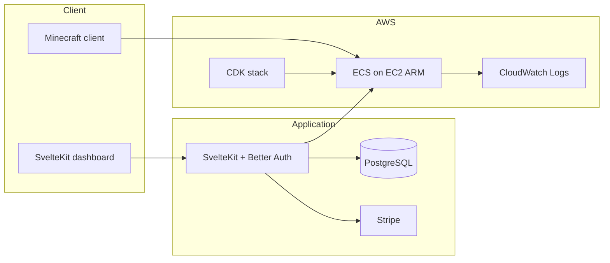

# ContainerMC

The easiest way to deploy and manage Minecraft servers in the cloud.

ContainerMC is a **Minecraft server platform-as-a-service (PaaS)**. Each server runs as a Docker container ([`itzg/minecraft-server`](https://github.com/itzg/docker-minecraft-server)) on **AWS ECS** (EC2-backed capacity), orchestrated from a **SvelteKit** dashboard. The goal is pay-as-you-go hosting with real-time analytics, deep customization (mods, plugins, versions), and operational features like backups and auto-stop — without the complexity of running your own infrastructure.

> **Early development.** The project is under active construction. Many UI surfaces exist ahead of the backend wiring. See [Implementation status](#implementation-status) below.

**Website:** [containermc.com](https://containermc.com)

---

## Vision

ContainerMC aims to be a full-featured Minecraft hosting platform:

- **One-click deploy** — pick version, server type (Vanilla, Paper, Forge, etc.), region, and hardware tier; get a joinable address in minutes
- **Real-time analytics** — player count, TPS, CPU/memory usage, and session history per server
- **Customization** — Modrinth mod/plugin installs, configurable JVM and server properties, world uploads
- **Cost efficiency** — usage-based billing on prepaid balance; auto-stop idle servers; transparent hourly rates
- **Reliability** — AWS-backed compute, CloudWatch logging, scheduled backups to object storage
- **Self-hosting** — optional path to run the control plane and/or game servers on your own hardware

---

## Architecture



| Layer | Technology |
| --- | --- |
| Frontend | SvelteKit 2, Svelte 5, Tailwind CSS, shadcn-svelte |
| Auth & billing | [Better Auth](https://www.better-auth.com/), Stripe (balance top-ups + subscription plugin) |
| Database | PostgreSQL, Drizzle ORM |
| Game servers | `itzg/minecraft-server` on ECS (bridge networking, host volume for world data) |
| Infrastructure | AWS CDK — VPC, ECS cluster, Auto Scaling Group (Graviton `t4g`), security groups, IAM, log group |
| Object storage (planned) | Cloudflare R2 (S3-compatible) for backups and assets |

### Repository layout

| Path | Description |
| --- | --- |
| [`web/`](web/) | SvelteKit application — marketing site, auth, dashboard, API routes |
| [`cdk/`](cdk/) | AWS CDK app — ECS cluster, capacity provider, networking, logging |
| [`.env.example`](.env.example) | AWS resource identifiers (from CDK outputs) for the web app |

---

## Implementation status

### Implemented

**Infrastructure (CDK)**

- VPC (2 AZs, no NAT gateways — public subnets for game hosts)
- ECS cluster with EC2 capacity provider (ARM Graviton, mixed `t4g` sizes, scale 0–20)
- Security groups for Minecraft Java (`25565/tcp`) and Bedrock (`19132/udp`)
- CloudWatch log group for server logs
- IAM roles for EC2 instances and ECS tasks

**Web application**

- Marketing landing page and pricing page shell
- Authentication: email/password, GitHub, and Google OAuth (Better Auth)
- Protected dashboard layout with navigation (servers, billing, analytics, settings)
- **Servers:** create server records (name, Minecraft version, type, AWS region, hardware tier); list and search; per-server detail route; start action updates DB status to `starting` (does not yet launch ECS tasks)
- **Billing:** prepaid balance display; add funds via Stripe Checkout; webhook handler for completed checkouts
- Database schema for users, balances, settings, servers, mods, sessions, backups, and metric snapshots
- AWS SDK clients (ECS, EC2, CloudWatch Logs, Route 53, SSM, S3/R2) and `launchServer()` helper that registers an ECS task definition and runs a task
- UI component library (shadcn-svelte), chart primitives (for future analytics)

**Auth & payments**

- Stripe customer created on sign-up
- User balance and settings rows created on registration

### Not yet implemented (or stub only)

These are planned or partially scaffolded but not wired end-to-end:

| Area | Status |
| --- | --- |
| **ECS lifecycle** | `launchServer()` exists but is not called from server start/stop/restart actions |
| **Real-time analytics** | Dashboard route is a placeholder; `server_snapshot` schema exists but no collection or charts |
| **Server console** | Detail page has a command input UI only — no RCON/log streaming |
| **DNS** | Copy-address uses `{slug}.containermc.com`; Route 53 integration not connected |
| **Stop / restart / delete** | Buttons and dialogs in UI; no server actions or ECS teardown |
| **Mods & plugins** | `server_mod` table (Modrinth IDs); no install flow |
| **Backups** | `server_backup` table; R2 env vars in `.env.example`; no backup jobs or restore UI |
| **Usage billing** | Hourly rates defined in constants; no metering, session tracking, or balance deduction |
| **Auto-stop** | Columns on `minecraft_server`; not enforced |
| **Auto-recharge** | Settings columns and billing UI shell; not functional |
| **Settings page** | Placeholder heading only |
| **Subscriptions** | Better Auth Stripe plugin with empty plan `priceId`s |
| **Pricing page** | Card layout without real plan copy or checkout |
| **Self-hosting & docs** | Sidebar resource links are placeholders |
| **Forgot password** | Route exists; flow may be incomplete |
| **Bedrock** | Port opened in CDK; task definition is Java-only today |

---

## Getting started

### For users

Sign up at [containermc.com](https://containermc.com) when the hosted product is available.

### For developers

**Prerequisites:** [Bun](https://bun.sh), Docker, Node.js (for CDK), AWS CLI configured for deployment.

#### 1. Local web app

```sh
cd web
bun install
docker compose up -d    # PostgreSQL
cp .env.example .env    # fill in auth, Stripe, database URL
bun run db:push
bun run dev
```

See [`web/README.md`](web/README.md) for more detail.

#### 2. AWS infrastructure

```sh
cd cdk
npm install
npx cdk bootstrap   # once per account/region
npx cdk deploy
```

Copy stack outputs into the web app environment (see [`.env.example`](.env.example) and [`web/.env.example`](web/.env.example)).

**CDK commands**

```sh
cdk synth      # CloudFormation template
cdk diff       # compare deployed vs local
cdk destroy    # tear down stack
```

Install the CDK CLI globally if needed:

```sh
npm install -g aws-cdk
```

---

## Acknowledgements

ContainerMC relies on countless open-source projects. Notable dependencies:

- [aws-cdk](https://github.com/aws/aws-cdk)
- [itzg/minecraft-server](https://github.com/itzg/docker-minecraft-server)
- [Svelte](https://github.com/sveltejs/svelte) & [SvelteKit](https://github.com/sveltejs/kit)
- [Better Auth](https://www.better-auth.com/)
- [Drizzle ORM](https://orm.drizzle.team/)
- [shadcn-svelte](https://www.shadcn-svelte.com/)
