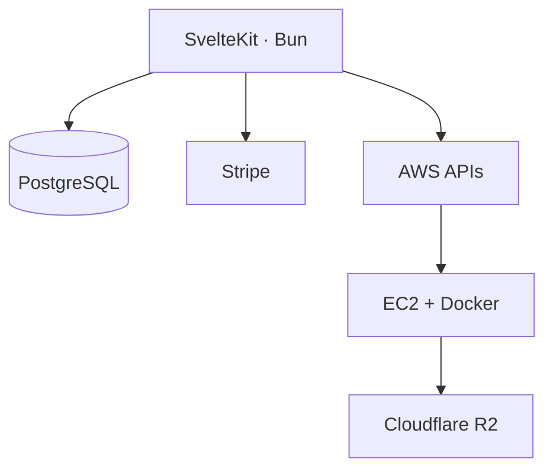

# ContainerMC

Pay-as-you-go Minecraft server hosting — provision cloud infrastructure, manage servers, and meter usage from a single web application.

ContainerMC is an early-stage product that automates Minecraft server lifecycle management on AWS: users create organizations, deploy servers on demand, and pay only while instances are running. The project pairs a SvelteKit web app with AWS CDK infrastructure and usage-based billing.

> **Status:** Actively under development.

## Highlights

- **Full-stack ownership** — SvelteKit app, PostgreSQL data model, auth, payments, and AWS provisioning in one codebase
- **On-demand infrastructure** — EC2 instances provisioned per server start, with Route 53 DNS and SSM-driven world sync
- **Usage-based billing** — Per-session cost tracking with Stripe Checkout for prepaid organization balance
- **Multi-tenant organizations** — Team accounts with member management via Better Auth

## Tech stack

| Layer | Technologies |
| --- | --- |
| Frontend | Svelte 5, SvelteKit 2, Tailwind CSS, shadcn-svelte |
| Runtime | Bun |
| Data | PostgreSQL, Drizzle ORM |
| Auth | Better Auth |
| Payments | Stripe |
| Cloud | AWS CDK, EC2, Route 53, SSM |
| Storage | Cloudflare R2 |
| Game server | [itzg/docker-minecraft-server](https://github.com/itzg/docker-minecraft-server) |

## Platform

- User authentication with email/password and social providers
- Organization creation and team membership
- Server creation, start, and stop with AWS EC2 provisioning
- Per-server DNS records via Route 53
- World data persistence with Cloudflare R2
- Session metering with hardware-tier hourly rates
- Stripe Checkout for organization balance top-ups
- AWS CDK stack for VPC, security groups, IAM, and SSM parameters

## Architecture



Starting a server reads networking parameters from SSM, launches an EC2 instance, assigns a DNS record, and opens a billing session. Stopping syncs world files to R2, terminates the instance, removes DNS, and closes the session with a computed cost.

## Project structure

```
containermc/
├── web/          SvelteKit application
├── cdk/          AWS CDK stack
└── README.md
```

## Getting started

### Prerequisites

- [Bun](https://bun.sh)
- Docker
- Node.js (for CDK)
- AWS CLI
- Stripe account
- Cloudflare R2 bucket

### Local web app

```sh
cd web
bun install
docker compose up -d
cp .env.example .env
bun run db:push
bun run dev
```

See [`web/README.md`](web/README.md) for additional detail.

### AWS infrastructure

```sh
cd cdk
npm install
export HOSTED_ZONE_ID=<your-route53-hosted-zone-id>
npx cdk bootstrap
npx cdk deploy
```

**Useful CDK commands:**

```sh
cdk synth
cdk diff
cdk destroy
```

## Roadmap

- Live server dashboard with console, logs, and performance metrics
- Mod and plugin installation via Modrinth
- Configurable auto-start and auto-stop
- Backup restore and scheduling

## Acknowledgements

ContainerMC builds on open-source projects including:

- [Svelte](https://github.com/sveltejs/svelte) and [SvelteKit](https://github.com/sveltejs/kit)
- [Better Auth](https://www.better-auth.com/)
- [Drizzle ORM](https://orm.drizzle.team/)
- [shadcn-svelte](https://www.shadcn-svelte.com/)
- [itzg/docker-minecraft-server](https://github.com/itzg/docker-minecraft-server)
- [AWS CDK](https://github.com/aws/aws-cdk)
